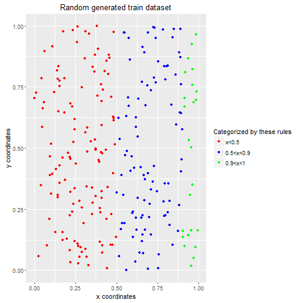
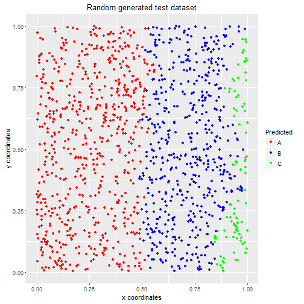
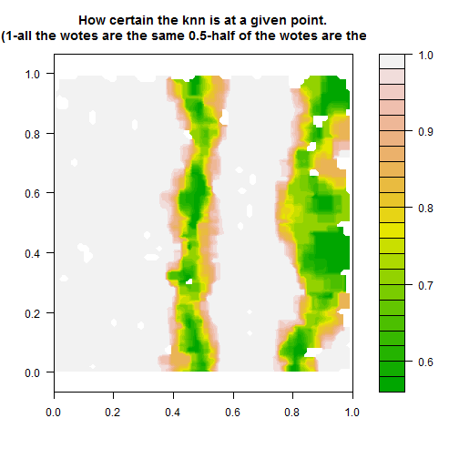

Demonstrating k-Nearest Neighbour Classification in shiny 
========================================================
author: CPD
date: 2016.01.24.
A Coursera project

k-Nearest Neighbour Classification
========================================================

Description

k-nearest neighbour classification for test set from training set. For each row of the test set, the k nearest (in Euclidean distance) training set vectors are found, and the classification is decided by majority vote, with ties broken at random. If there are ties for the kth nearest vector, all candidates are included in the vote.

My work
========================================================

You can find the demonstraing shiny app here https://cpdsh.shinyapps.io/shinyproject/

I generated for the learning set random points in a 2 dimension plane 
- 0<x<1 and
- 0<y<1

And classified them based on these rules:
- RED (A) if "x<0.5"
- BLUE (B) if "0.5<x<0.9"
- GREEN ( C) if "0.9<x<1"

After this I executed the knn algorithm.

Demonstration of the results
========================================================
To show the results I plotted these diagrams 

- generated coordinates for the training set

***
- generated coordinates for the test set and the categorization with the algorithm

The certainty how the algorithm decided
========================================================
 
  - if all the neighbours are the same then 1 
  - if half the neighbours are the same then 0.5
  - To draw this map I used the filled.contour function, and I also had to classify many areas on the plane based on the surrounding average classification. Otherwise if there is no prediction in the area and I can not classify that patch. For example a little 0.06 by 0.06 rectangle is green if the average of the certainty of predictions in the area is 0.5.  

***

